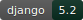

<div align="center">

```
    ███████╗ █████╗  ██████╗████████╗██████╗ ██╗   ██╗██╗     ███████╗███████╗
    ██╔════╝██╔══██╗██╔════╝╚══██╔══╝██╔══██╗██║   ██║██║     ██╔════╝██╔════╝
  █████╗  ███████║██║        ██║   ██████╔╝██║   ██║██║     ███████╗█████╗
  ██╔══╝  ██╔══██║██║        ██║   ██╔═══╝ ██║   ██║██║     ╚════██║██╔══╝
    ██║     ██║  ██║╚██████╗   ██║   ██║     ╚██████╔╝███████╗███████║███████╗
    ╚═╝     ╚═╝  ╚═╝ ╚═════╝   ╚═╝   ╚═╝      ╚═════╝ ╚══════╝╚══════╝╚══════╝
         B I L L I N G   A P P
```

**Facturation electronique B2B pour la France.**

[](https://github.com/factpulse/factpulse_billing_app/actions/workflows/ci.yml)





---

Application de facturation electronique conforme **Factur-X** (EN 16931),
adossee a [FactPulse](https://factpulse.fr) pour la generation de PDF normes
et la transmission vers les plateformes de dematerialisation agreees.

Interface HTMX/Alpine.js | API REST | Serveur MCP | Multi-orga | JWT + OAuth 2.1

</div>

---

## Ce que ca fait

| | Fonctionnalite |
|---|---|
| :receipt: | Gestion clients, fournisseurs, produits |
| :arrows_counterclockwise: | Cycle de vie facture : **brouillon** -> **validee** -> **transmise** -> **acceptee** |
| :page_facing_up: | Generation PDF Factur-X via l'API [FactPulse](https://factpulse.fr) |
| :satellite: | Transmission vers plateforme agreee + suivi de statut |
| :mag: | Import clients via API SIRENE |
| :credit_card: | Encaissement via Stripe ou GoCardless (optionnel) |
| :hook: | Webhooks sortants pour integrations tierces |
| :robot: | Serveur MCP integre — pilotez la facturation depuis Claude Desktop ou Claude Code |
| :earth_africa: | Bilingue francais / anglais |

---

## Pre-requis

Un compte [FactPulse](https://factpulse.fr) est necessaire pour generer les PDF Factur-X
et transmettre les factures electroniques. Sans compte FactPulse, l'application ne peut pas
produire de factures conformes.

---

## Quick Start

### Docker (recommande)

```bash
cp .env.example .env
make dev
# -> http://localhost:8000 — Postgres, Redis, MinIO inclus
```

### Sans Docker (SQLite + [uv](https://docs.astral.sh/uv/))

```bash
make local-install    # Installe les deps
make local-migrate    # Pose le schema
make local-run        # Lance le serveur
```

### Commandes du quotidien

```bash
make migrate          # Migrations
make seed             # Donnees de demo
make test             # Tests
make createsuperuser  # Creer un admin
make messages         # Generer les traductions
make compilemessages  # Compiler les traductions
```

---

## Deploiement en prod

### 1. Configurer

```bash
cp .env.example .env
```

Variables **obligatoires** :

| Variable | Quoi |
|---|---|
| `SECRET_KEY` | Cle secrete Django |
| `ALLOWED_HOSTS` | Votre domaine |
| `POSTGRES_PASSWORD` | Mot de passe PostgreSQL |
| `CSRF_TRUSTED_ORIGINS` | `https://votre-domaine.example.com` |
| `CORS_ALLOWED_ORIGINS` | `https://votre-domaine.example.com` |
| `FACTPULSE_API_URL` | URL de votre instance FactPulse |
| `FACTPULSE_EMAIL` | Email du compte FactPulse |
| `FACTPULSE_PASSWORD` | Mot de passe FactPulse |

> Generer une `SECRET_KEY` :
> ```bash
> python3 -c "from django.core.management.utils import get_random_secret_key; print(get_random_secret_key())"
> ```

### 2. Lancer

```bash
make prod
```

Gunicorn + WhiteNoise, Postgres, Redis, MinIO, Celery worker + beat. Tout d'un coup.

### 3. Initialiser la base

```bash
docker compose -f docker-compose.yml -f docker-compose.prod.yml exec web python manage.py migrate
docker compose -f docker-compose.yml -f docker-compose.prod.yml exec web python manage.py collectstatic --noinput
docker compose -f docker-compose.yml -f docker-compose.prod.yml exec web python manage.py createsuperuser
```

### 4. Reverse proxy

L'app ecoute sur `127.0.0.1:8100`. Collez un nginx / Caddy / Traefik devant pour le SSL.

> Exemple nginx : [`nginx/example.conf`](nginx/example.conf)

---

## Architecture

```
                        ┌──────────────────────────┐
                        │      Reverse proxy       │
                        │  nginx / Caddy / Traefik │
                        └────────────┬─────────────┘
                                     │ :8100
  ┌──────────────────────────────────▼────────────────────────────────┐
  │  docker compose                                                   │
  │                                                                   │
  │   ┌──────────┐      ┌──────────────┐      ┌──────────────┐        │
  │   │   web    │      │    celery    │      │  celery-beat │        │
  │   │ gunicorn │      │    worker    │      │  (scheduler) │        │
  │   └────┬─────┘      └──────┬───────┘      └──────┬───────┘        │
  │        │                   │                     │                │
  │   ┌────▼────┐       ┌──────▼──────┐      ┌───────▼─────┐          │
  │   │Postgres │       │    Redis    │      │    MinIO    │          │
  │   └─────────┘       └─────────────┘      └─────────────┘          │
  └───────────────────────────────────────────────────────────────────┘
```

### Structure du code

```
factpulse_billing_app/
├── config/             # Settings Django (base / dev / prod)
├── apps/
│   ├── core/           # Organisations, auth JWT, middleware, permissions
│   ├── billing/        # Factures, fournisseurs, clients, produits + services metier
│   ├── payments/       # Integrations Stripe & GoCardless
│   ├── webhooks/       # Webhooks sortants
│   ├── factpulse/      # Client API FactPulse + taches Celery
│   ├── assistant/      # Registre d'outils (partage API, UI, MCP)
│   ├── mcp/            # Serveur MCP (streamable-http, multi-tenant)
│   ├── oauth/          # Provider OAuth 2.1 (PKCE, Dynamic Client Registration)
│   └── ui/             # Vues frontend HTMX / Alpine.js
├── docker-compose.yml
├── Makefile
└── pyproject.toml      # Deps gerees par uv
```

---

## Documentation

| | |
|---|---|
| :books: [Deployment Guide](docs/deployment.md) | Deploiement standalone (Docker et manuel) |
| :electric_plug: [API Guide](docs/api-guide.md) | Reference API REST + exemples Python |
| :computer: [Portal Guide](docs/portal-guide.md) | Guide de l'interface web |
| :robot: [MCP Guide](docs/mcp-guide.md) | Integration Claude Desktop & Claude Code |
| :floppy_disk: [Backup Guide](docs/backup.md) | Sauvegarde et restauration |

---

<div align="center">

**[GNU AGPL-3.0](LICENSE)** — Libre comme l'air, copyleft comme il faut.

*Built with Django, HTMX, and Alpine.js.*

</div>
